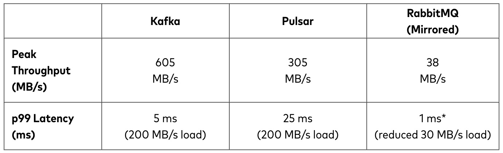

# MQ

[toc]

1. Pulsar、Kafka、RabbitMQ比较
  
   - 性能（吞吐量、延迟）
  
  参考：https://www.confluent.io/blog/kafka-fastest-messaging-system/
   - 消息消费模式、存储架构
   kafka使用pull模型，pulsar和rabbitMQ使用push模型；
   存储结构上，kafka使用分布式提交日志，写入的时候会附加到日志的末尾，读取时按照偏移量读取。pulsar和rabbitMQ使用基于索引的存储系统，他们将数据存储在树中，以保证快速读取，但是写入开销会变大，和日志比较表现为写入的吞吐量降低、写入延迟增加、写放大。
   - 性能和可用性
  在弹性伸缩上pulsar比kafka强

2. docker安装pulsar

    ```shell
    // 拉取最新镜像
    docker pull apachepulsar/pulsar:latest
    // 服务启动
    docker run -it -p 6650:6650 -p 8080:8080 --mount source=pulsardata,target=/pulsar/data --mount source=pulsarconf,target=/pulsar/conf apachepulsar/pulsar:3.0.0 bin/pulsar standalone
    ```

3. docker安装kafka集群

    ```shell
    // 利用docker-compose启动
    // 1. 启动一个生产者
    docker exec -it kafka0 /opt/bitnami/kafka
    // 2. 启动一个消费者
    ```
