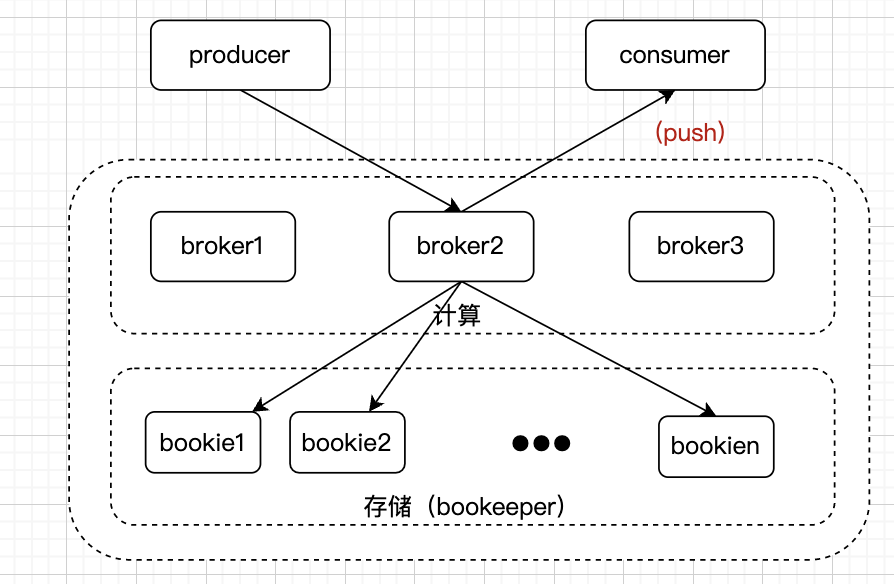

# web组件

[toc]

## 一、MySQL

### 1.1 索引

1. 索引分类
按照4个维度：
（1）数据结构：B+树、hash、full-text
（2）存储结构：聚簇索引和非聚簇索引
（3）字段特性：主键索引、唯一索引、普通索引、前缀索引
（4）字段个数：单列索引和联合索引

2. 联合索引
联合索引遵循最左原则，对于（a,b,c）联合索引来说，a是全局有序的，b、c是局部有序的：

    ```sql
    Q1：select * from t_table where a > 1 and b = 2
    -- a的查询使用了联合索引，b没有使用到联合索引

    Q2：select * from t_table where a >= 1 and b = 2
    -- a的查询使用了联合索引，b也使用到联合索引

    Q3：select * from t_table where a between 2 and 8 and b = 2
    -- between是左右闭区间的，所以相当于 2 <= a <= 8
    -- a的查询使用了联合索引，b也使用到联合索引

    Q4：select * from t_table where name like '陈%' and age = 22
    -- like模糊匹配的时候是闭区间，[j, ?)，坐标会从陈开始匹配，此时全为陈的数据内，age是有序的
    -- name的查询使用了联合索引，age也使用到联合索引
    ```

    联合索引进行排序

    ```sql
    -- 对于下面这个sql来说，最好的做法是对status和create_time建立联合索引。
    -- 因为查询的时候，如果只用到status索引，那么还需要对create_time进行排序，这个时候就需要文件排序，也就是在 SQL 执行计划中，Extra 列会出现 Using filesort
    -- 所以，要利用索引的有序性，在 status 和 create_time 列建立联合索引，这样根据 status 筛选后的数据就是按照 create_time 排好序的，避免在文件排序，提高了查询效率
    select * from order where status = 1 order by create_time asc
    ```

3. 索引下推
对于联合索引(a,b)，在执行`select * from table where a > 1 and b = 2`语句的时候，
只有a字段能用到索引，再找到满足a>2条件的数据之后：
mysql5.6之前，进行回表，把数据拿出来，再进行后面b=2的判断
mysql5.6之后，不会回表，而是紧接着判断后面的b=2，如果满足则才进行回表
**当执行计划里Extra中出现 'using index condition' 时，代表使用了索引下推优化**

4. 索引的适用场景

   - 适用场景的字段：具备唯一性限制的字段、经常用在where查询条件的字段、经常用在group by和order by的字段
   - 不适用场景的字段：where条件、group by、order by中用不到的字段、区分度小的字段（男女）、经常更新的字段、表数据少的时候

5. 优化索引方法

   - 覆盖索引优化：业务中经常查询某张表的某些结果（比如商品表中的商品名称、商品价格），那就对(商品id、名称、价格)做一个联合索引，那么在查询这两个字段的时候就不会进行`回表`操作
   - 主键索引自增：innodb创建主键索引的时候默认都是聚簇索引，数据被存放在B+树的叶子上，同一个叶子节点上的数据都是顺序存放的。如果使用自增主键，那么在插入新数据的时候都是追加操作，不需要进行已有数据的移动，效率会非常高。如果使用非自增主键，每次插入新数据的位置都是随机的，会造成页内数据的移动。
   - 索引设置not null：索引为null会导致优化器在进行索引选择时更复杂；null值在行格式中会额外占用存储空间（会记录null值列表）
   - 防止索引失效：
   （1）左模糊匹配或者左右模糊匹配：`like %xx`、`like %xx%`
   （2）在查询条件中对索引列进行计算、函数、类型转换

        ```sql
        -- name为二级索引
        select * from t_user where length(name)=6;
        -- id为主键索引
        select * from t_user where id + 1 = 10;
        -- phone为字符串
        select * from t_user where phone = 1300000001; -- MySQL会自动把字符串转为数字
        ```

    （3）联合索引非左匹配
    （4）where条件中的or

      ```sql
      -- where子句中，or前的条件列是索引列，or后的条件列是非索引列
      -- or的含义是两者 取其一即可。只有一个条件列是索引列是没有意义的，只要有条件列不是索引列，就会进行全表扫描。解决的办法就是把age也设置为索引
      select * from t_user where id = 1 or age = 18; 
      ```

### 1.2 事务

1. 事务特性（ACID）

   - 原子性：要么全部成功要么全部失败，通过`回滚日志（undo log）`保证
   - 一致性：A向B转账，要保证A钱少x的同时，B钱多了x，通过`原子性、隔离性、持久性`保证
   - 隔离性：数据库允许多个并发事务对数据进行读和修改，隔离性防止多个并发事务执行过程中由于交叉执行而导致数据不一致，通过`重做日志（redo log）`来保证
   - 持久性：事务处理结束后，对数据的修改是永久的，即便系统故障也不能丢失，通过`多版本并发控制（mvcc）`或`锁机制`来保证

2. 并发事务引发的问题

   - 脏读：A和B两个事务同时在处理，B在A未更新事务之前进行数据读取，A更新事务后又回滚。那么B就读到了“过期的数据”；
   - 不可重复度：A事务读取一个数据，然后执行业务逻辑，此时事务B去修改了该数据，A再去读，出现一个事务中读取同一个数据不一致；
   - 幻读：A事务读取符合某条件的数据条数（比如未5），此时B事务插入一条符合该条件的记录，导致A事务在后续再次读取符合该条件的数据条数时，数量变为6；

3. 事务的隔离级别

   - 读未提交：一个事务还没有提交，它的变更就能被其他事务看到
   - 读已提交：一个事务提交后，它的变更才能被其他事务看到
   - 可重复读：一个事务执行过程中看到的数据一直和事务启动时看到的一样（mysql innodb默认的隔离级别）
   - 串行化：对记录加读写锁，在多个事务对这条记录进行读写时，如果发生了读写冲突，会等一个事务处理完成后才能执行下一个事务

    具体实现：
      - 【读未提交】：直接读取
      - 【读已提交】和【可重复读】：Read View。可以把 Read View 理解成一个数据快照，就像相机拍照那样，定格某一时刻的风景。读已提交是在`每个语句执行前`都会重新生成Read View；而可重复读是在`启动事务时`生成Read View，整个事务执行过程中都使用这个Read View
      - 【串行化】：加读写锁

    在“可重复读（RR）”下，mysql innodb也可以在很大程度上解决幻读的问题，方案有两种：
      - 快照读（普通select）：通过mvcc的方式解决，事务在执行过程中，读到的数据一直和该事务启动时看到的数据是一致的，即使其他事务插入记录，当前事务也是查不到的
      - 当前读（select ... for update），通过加`记录间隙锁`的方式解决。在执行select for update时，会加上锁，其他事务在锁范围内插入一条记录时，插入记录就会被阻塞，从而避免幻读问题

    幻读没有被完全解决：
    
    更新一个之前事务启动后前面查到的数据（虽然听起来很违和），其他事务在执行时添加了这条数据。

4. 多版本并发控制（MVCC）


这种通过「版本链」来控制并发事务访问同一个记录时的行为就叫 MVCC

### 1.3 锁

1. 全局锁

    ```sql
    -- 开启全局锁
    -- 开启后整个数据库为只读状态
    flush tables with read lock
    -- 解锁
    unlock tables
    ```

    应用场景：全库备份，此时业务不可修改数据库。解决备份数据库时业务依然可修改的方法：开启RR隔离级别，并在备份数据库前开启事务，这个时候会创建一个Read View，备份期间都是用这个Read View，业务对数据库的修改也不会影响备份。

2. 表级锁

     - 表锁：可以针对表进行加读锁或者写锁。平时业务层面避免使用表锁，因为粒度太大
     - 元数据锁（MDL）：属于表级别的隐式锁，在CRUD时，加的是MDL读锁，在修改表结构时，加的是MDL写锁。MDL在事务执行期间是一致持有的，在提交后，会自动释放
     - 意向锁：意向锁的目的是为了快速判断表里是否有记录被加锁
     - 自增锁：插入数据时可以不指定主键值，数据库会自动给主键赋递增的值，这是靠自增锁实现的

3. 行级锁
    innodb支持行级锁、MyISAM不支持行级锁
    普通的select是快照读，所以不需要加行级锁，在select for update时才会加。

   - 记录锁（record lock）：仅仅把一条记录锁上。分为共享锁（S，读读共享，读写互斥）和独占锁（X，写写互斥，读写互斥）
   - 间隙锁（gap lock）：锁定一个范围，但是不包括记录本身
   - 记录间隙锁（next-key lock）：记录锁和间隙锁的组合。锁定一个范围并且锁定记录本身

    ```sql
    -- 对读取的记录加共享锁(S型锁)
    select ... lock in share mode;
    -- 对读取的记录加独占锁(X型锁)
    select ... for update;
    -- update和delete都会加行级X型锁
    update table .... where id = 1;
    delete from table where id = 1;
    ```

    select ... for update加的X锁属于行级还是表级？
    **查询条件为主键、主键范围、索引为行锁；查询条件无主键、索引或者查询无结果时为表锁**

4. 死锁场景

形成死锁条件：`互斥、持有且等待、不可强占用、循环等待`

在执行插入语句时，如果插入的记录在其他事务持有间隙锁范围内，插入语句就会被阻塞，因为插入语句在碰到间隙锁时，会生成一个插入意向锁，然后插入意向锁和间隙锁之间是互斥的关系。
如果两个事务分别向对方持有的间隙锁范围内插入一条记录，而插入操作为了获取到插入意向锁，都在等待对方事务的间隙锁释放，于是就造成了循环等待，满足了死锁的四个条件：互斥、占有且等待、不可强占用、循环等待，因此发生了死锁

解决死锁：

- 设置事务等待超时
- 开启主动死锁检测

## 二、Redis

### 2.1 redis基础

### 2.1.1 redis的I/O模型

redis处理任务是单线程的，而接收客户端请求是多线程的。这样做的目的是使得用户无需考虑线程安全的问题（死锁），无需考虑事务控制，需要考虑执行顺序问题。


redis的I/O模型采用了`多路复用技术`，对于多路选择技术，包括select、poll、epoll。

select和poll在实现方式上一样，唯一不一样的是底层数据结构上select使用的是数组，而poll使用的是链表。

- select和poll：轮询方式
事件分发器会轮询式的判断socket连接是否有请求，有请求则进行处理。
存在的问题：对客户端的就绪处理有延迟、一直占用着处理器进行轮询
- epoll：回调方式
客户端就绪后会通知事件处理器，事件处理器去进行回调函数的处理。

1. listpack

2. 跳表（skiplist）

跳表是一种`随机化`的数据结构，在插入时，节点的层级随机，在删除的时候，直接修改删除节点前后的指针就可以了：


### 2.2 redis持久化

redis启动的时候会产生三个数据文件，包括aof、rdb、manifest文件。其中aof是增量日志文件，每执行一条`写操作`，就会`追加`一条记录进入该文件；rdb是内存快照，他会将某个时刻内存中的数据以二进制的方式写入磁盘；manifest文件用来记录所有的aof和rdb文件，以保证执行顺序。

#### 2.2.1. AOF（增量日志）

```bash
# +表示一个正确消息信息
# -表示一个错误消息信息
# *代表消息体有多少行
# $代表下一行消息数据的长度
*2
$6
SELECT
$1
0
*3
$3
set
$4
test
$0
```

1. aof数据同步策略

      - always（同步写回）
      - everysec（每秒写回）
      - no（由操作系统控制写回）

     数据同步：客户端提交写操作之后，命令会提交到aof_buf，aof_buf缓存数据会持久化到磁盘（aof文件），`同步操作是在主进程中进行的`。提交的时机（appendfsync）分为三种策略：包括always、everysec、no，他们的效率以此提升、数据安全性依次降低。no的时候数据同步的时间由操作系统负责，linux系统默认同步周期为30s（最多会丢30s的数据）

2. aof重写机制

rewrite就是对aof文件进行重写整理，当rewrite开启后，主进程redis-server就会创建出一个子进程bgrewriteaof，`由该子进程完成rewrite操作`。其过程为：**首先先对aof文件进行rewrite计算，将计算结果写入到一个临时文件，写入完毕后再rename该临时文件为原aof文件名称，覆盖原文件。**

启动方式分为手动和自动

```bash
# 手动
127.0.0.1:6379> bgrewriteaof
# 自动开启
# 在redis.conf文件中进行修改
auto-aof-rewrite-percentage 100 # 当前文件和上次写入文件大小的百分比值
auto-aof-rewrite-min-size 64mb # 文件大小阈值
```

rewrite计算：读操作、无效命令、过期数据不写入aof；多条重复命令合并写入aof：

```bash
# key在最后删除，则认为是无效命令，所有之前的相关命令都不写入
set name petter
del name

# 两条命令会合并成一条（以最后一条为准）写入aof
# 例子1：合并成set name lax
set name tom
set name lax
# 例子2：合并成：incrby num 30
set num 10
incrby num 5
incrby num 10
incrby num 15
```

#### 2.2.2 RDB（内存快照）

rdb是`全量快照`，使用save或者bgsave命令实现，前者是在redis-server中执行，后者是在子线程中执行

1. rdb优势
rdb文件较小，数据恢复速度快

2. rdb劣势

- 数据安全性较差
- 写时复制会降低性能

#### 2.2.3 写时复制技术

linux中的进程管理技术

#### 2.2.4 技术比较

1. 技术选型

    一般业务场景下推荐rdb和aof混合持久化
    对数据安全性要求不高的话，使用rdb持久化（速度快）
    不推荐使用纯aof方式（文件太大）
    若redis仅用于缓存，则无需使用任何持久化技术

2. 混合rdb和aof持久化

启动混合模式后，AOF文件的前半部分是RDB格式的全量文件，后半部分是AOF格式的增量数据。

这样的好处在于，重启 Redis 加载数据的时候，由于前半部分是 RDB 内容，这样加载的时候速度会很快。
加载完 RDB 的内容后，才会加载后半部分的 AOF 内容，这里的内容是 Redis 后台子进程重写 AOF 期间，主线程处理的操作命令，可以使得数据更少的丢失。

### 2.3 redis事务

Redis事务仅保证了数据的一致性（ACID中的C），redis的事务本质上一组命令的批处理。这组命令在执行过程中会顺序的、一次性的执行完成，只要没有出现语法错误，就不会中断。

redis事务的隔离机制
命令通过乐观锁（watch）实现了简单的隔离性，没有复杂的隔离级别。

## 三、MQ

### 3.1 主流消息队列对比（RabbitMQ、Kafka、Pulsar）

1. 性能和时延
Kafka和Pulsar都能达到单机10W+的吞吐，毫秒级的时延
Kafka快的原因：

Pulsar快的原因：

2. 可靠性（C）和可用性（A）
Kafka：可靠性上，做参数优化后，可以做到`最小概率不丢失`；可用性上，分身设计就是分布式，一个数据多个副本，少数机器宕机不会导致不可用。
Pulsar：可靠性上，做参数优化后，可以做到`零丢失`；broker本身就是无状态的，能动态扩容，部分broker不可用不会导致整体不可用，存储层bookeeper采用分段存储机制，无写入不可用风险。
3. topic数量对吞吐量的影响
Kafka：在topic从几十增加到几百的时候，吞吐量会下降，在同等机器下，Kafka要确保topic不能过多，如果要支撑大规模的topic，需要进行硬件资源的扩充
Pulsar：得益于Pulsar的存储和计算的分离，计算的broker是无状态的，存储使用bookeeper，两者可以独立扩容。因为topic数量对吞吐量不会造成很大影响
4. 消费模式
Kafka采用消费者拉取的方式；
RabbitMQ，Pulsar采用消息队列推送到消费者的方式；
**推拉对比：**
      - 推（push）：实时性强；消息速率由消息队列控制，消费者无法充分利用资源；因不同消费者消费速率不同，可能会出现消费失败的情况，消息队列需要自行进行重试并且保存失败消息；
      - 拉（pull）：实时性弱；消息队列需要消费者告知目前的消费进度，消费者可以自行控制消费速率；消费者和消息队列需要建立长连接，轮询消息队列看是否有消息就绪；

5. 消费模型

   - 队列模型（Pulsar）
   
   每条消息只能被一个消费者消费
   - 发布订阅模型（Kafka）
   
   将消息发往Topic中，所有订阅了这个Topic的订阅者都能消费这条消息。
<font color='red'>总结：队列模型相当于单聊1对1，发布订阅模型相当于群聊1对多</font>

6. 架构对比
    Kafka：计算和存储未分离，都在Broker中进行。

    

    - 集群容量受最小节点控制
    - 容量扩展需要对分区重新平衡，消耗I/O和网络带宽
    - 丢失一个副本后，需要重新复制整个分区后才可用
    - 生产者和消费者分区策略：一条消息发给一个分区；一个分区的消息只能分配给一个消费者组的一个消费者

    Pulsar：计算和存储分离，计算在Broker中，存储在Bookie中。

    

    - 集群中的数据分布的比较均衡（bookeeper自行管理），扩展时不需要拷贝和重新平衡
    - 数据具备修复功能，其中一块数据块坏掉后，可以通过其他副本进行修复，避免了全量数据拷贝

7. 存储对比
Kafka：
数据在分区中存储到segment（段）中，里面包含了消息的具体数据（.log）、消息位置索引（.index）、消息生成时间戳（.timeindex）

Pulsar：


扩展：Bookeeper架构

### 3.2 如何保证消息消费的顺序性

消息在同一个Topic（逻辑单元，可以认为是邮箱）中是无序的，但是在同一个Partition中是有序的。生产者写消息时，将需要保证消息消费顺序性的消息集合写到同一个分区中，且只有一个消费者去消费这个分区即可。
在某些业务场景下这种做法是可取的，比如业务系统收发消息可以按照商户隔离，每个商户内部产生的消息需要保证顺序性。如下图，用户对某个商户下单的业务包括`下单`、`支付`、`完成`这三个步骤，每个步骤都会产生一条消息，消费者端在消费消息的时候需要严格保证这三条消息的相对有序性（中间可以掺杂着其他消息）
具体实现方式就是：**生产者在发送消息的时候指定key，消息队列根据key将消息分配到指定的分区，相同的key分配到同一个分区；同一个分区支持多个消费者消费，但是相同的key只会分配给同一个消费者；消费者在处理消息的时候一般会开启多线程处理，通过channel控制并发执行顺序，或者将线程池改为多个队列，每个队列用单线程处理来保证消息处理时的顺序**

对于事务型业务，为了确保消息可以正常被处理，需要增加异步重试机制，处理失败的消息添加到mysql的重试表中，通过巡检程序进行定时的异步重试。

### 3.3 如何保证消息重复消费问题

1. Kafka

（1）最多一次
保证每条消息commit成功之后，再消费处理，消息可能丢失，但是不会重复（消费失败）
（2）最少一次
保证每条消息消费成功之后，再进行commit，消息不会丢失，但是可能重复（commit不成功）
（3）精确一次
最少一次+幂等性
   - 通过配置ack参数=-1实现最少一次
   - 给producer分配一个pid，往同一个partition发送消息的时候会附带seq，broker内部会对` <pid,partition,seq> `进行缓存进行去重

  业务层面上保证幂等性的方式还包括：在插入mysql数据时，使用insert into ... on duplicate update确保多次插入的幂等性
2. Pulsar

### 3.4 如果解决消息积压问题


- 消息体过大
一次简单的消息从生产到消费过程，需要经过2次网络IO和2次磁盘IO。如果消息体过大，势必会增加IO的耗时，进而影响kafka生产和消费的速度。消费者速度太慢的结果，就会出现消息积压情况。消息体过大，还会浪费服务器的磁盘空间，稍不注意，可能会出现磁盘空间不足的情况。
解决方案：消息中的内容存储到表中，消息传递的时候只传消息id和消息状态，数据都从数据表中获取。
- 路由规则不合理
比如按照商户路由到分区，会导致有的商户下单特别都，有的下单很少，下单多的商户对应的分区就会出现消息积压的情况。可以考虑按照订单号进行路由，同一个订单号产生的所有消息都放到同一个分区中。（不会出现单个订单发消息特别多的情况）
- 批处理任务
批处理任务会导致瞬时生产大量消息。这种情况只能提高消费者处理速度，通过增加消费者消费速度（比如增加线程数量）。
- 表过大
消费时sql操作太慢，历史数据进行归档，数据只保留最近几天的。
