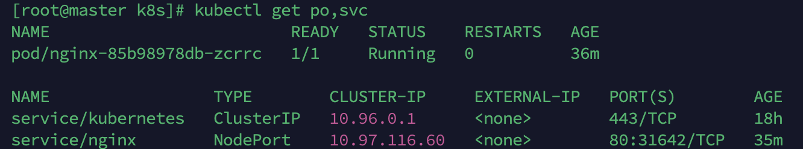
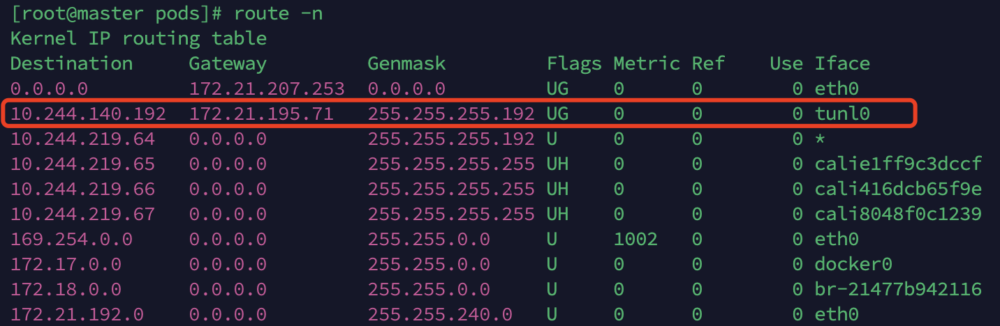

# k8s

[toc]

## 一、k8s基础和操作

### 1.1 k8s搭建

分为一主多从和多主多从：
一主一从：搭建简单，有单机故障风险，适用于测试环境；
多主多从：搭建麻烦，安全性高，适用于生产环境；

参考：https://www.jb51.net/article/256486.htm

软件环境：

- 操作系统：centos7
- Docker：20+
- k8s：1.23.6

1. 初始操作

    ```shell
    # 关闭防火墙
    systemctl stop firewalld
    systemctl disable firewalld

    # 关闭selinux
    sed -i 's/enforcing/disabled/' /etc/selinux/config # 永久
    setenfore 0 # 临时

    # 关闭swap
    sed -ri 's/.*swap.*/#&/' /etc/fstab # 永久
    swapoff -a # 临时

    # 设置主机名
    hostnamectl set-hostname {{hostname}}

    # 重启机器

    # 将集群节点添加hosts
    vi /etc/hosts

    {{master-ip}} master
    {{slave1-ip}} slave1

    # 设置网桥参数
    cat << EOF > /etc/sysctl.d/k8s.conf
    net.bridge.bridge-nf-call-ip6tables = 1
    net.bridge.bridge-nf-call-iptables = 1
    net.ipv4.ip_forward = 1
    EOF

    # 时间同步
    yum install ntpdate -y
    ntpdate time.windows.com
    ```

2. 安装docker

    ```shell
    # 安装yum-utils
    sudo yum install -y yum-utils
    # 设置yum docker阿里镜像源
    sudo yum-config-manager --add-repo https://download.docker.com/linux/centos/docker-ce.repo

    # 安装docker20
    sudo yum install docker-ce-20.10.7 docker-ce-cli-20.10.7 containerd.io

    # 验证安装
    docker version

    # 设置docker cgroup
    vi /etc/docker/daemon.json
    {
      "exec-opts": ["native.cgroupdriver=systemd"]
    }

    # 重新更新配置
    systemctl daemon-reload

    # 启动开机启动
    systemctl start docker
    systemctl enable docker
    ```

3. 安装k8s

    ```shell
    # 设置yum k8s阿里镜像源
    vi /etc/yum.repos.d/kube.repo

    [kubernetes]
    name=Kubernetes
    baseurl=https://mirrors.aliyun.com/kubernetes/yum/repos/kubernetes-el7-x86_64/
    enabled=1
    gpgcheck=1
    repo_gpgcheck=1
    gpgkey=https://mirrors.aliyun.com/kubernetes/yum/doc/yum-key.gpg https://mirrors.aliyun.com/kubernetes/yum/doc/rpm-package-key.gpg

    # 安装k8s
    yum install -y --nogpgcheck kubelet-1.23.6 kubeadm-1.23.6 kubectl-1.23.6

    # 检查是否安装成功
    kubelet --version
    kubectl version
    kubeadm version

    # 运行并设置开机启动
    systemctl start kubelet
    systemctl enable kubelet
    ```

4. 启动

    ```shell
    kubeadm init \
    --apiserver-advertise-address=172.21.195.70 \
    --image-repository registry.aliyuncs.com/google_containers \
    --kubernetes-version=1.23.6 \
    --service-cidr=10.96.0.0/12 \
    --pod-network-cidr=10.244.0.0/16

    # 日志查看
    journalctl -xefu kubelet
    ```

    成功启动k8s
    
    按照提示输入三条命令即可运行

5. 加入k8s node

    在master节点获取token和证书hash：

    ```shell
    # 查看token
    kubeadm token list
    # 如果没有token需要create
    kubeadm token create

    # 获取证书hash
    openssl x509 -pubkey  -in /etc/kubernetes/pki/ca.crt | openssl rsa -pubin -outform der 2>/dev/null | \
    openssl dgst -sha256 -hex | sed 's/^.* //'
    ```

    在从节点加入：

    ```shell
    # 从节点设置docker cgroup
    # 同上
    # 加入master
    kubeadm join 172.21.195.70:6443 --token ao6grt.a65eie2qy7dwwehr \
      --discovery-token-ca-cert-hash sha256:8eb205c8609684f6a6ec6e97bab0961f3977079fda1a48a60519c19977018684 
    ```

6. 部署cni网络插件
CNI（Container Network Interface）：容器网络的 API 接口

    ```shell
    # 查看节点
    kubectl get no
    # 查看组件状态
    kubectl get cs
    # 查看pod（需要指定命名空间）
    kubectl get pods -n kube-system
    # 上述coredns首次不会reader，这是因为网络的原因
    # 下面需要部署集群网络

    # 拉取网络配置文件
    curl https://calico-v3-25.netlify.app/archive/v3.25/manifests/calico.yaml -O

    # 修改配置文件中 <CALICO_IPV4POOL_CIDR>
    - name: CALICO_IPV4POOL_CIDR
      value: 10.244.0.0/16
    # 修改calico拉取镜像的地址
    sed -i 's#docker.io/##g' calico.yaml
    # 查看修改后的镜像地址结果
    grep image calico.yaml
    # 使用kubectl根据yaml构建应用
    kubectl apply -f calico.yaml
    # 查看pod情况
    kubectl get po -n kube-system
    # 查看pod运行状态
    kubectl describe po calico-node-gzcqk -n kube-system
    # 查看下载的镜像
    docker images
    # 查看网络情况（列出系统上可用的所有网络接口）
    ip link
    ```

7. 测试集群

    ```shell
    # 创建一个nginx无状态应用
    kubectl create deployment nginx --image=nginx
    # 暴露一个端口给这个服务
    kubectl expose deployment nginx --port=80 --type=NodePort

    # 查看pod和服务
    kubectl get po,svc
    # 验证服务
    # 同理访问从节点172.21.195.71:31642也可以访问到服务
    curl 172.21.195.70:31642
    ```

    
    

8. 在从节点使用kubectl

    ```shell
    # 从主节点远程传输文件到从节点
    scp /etc/kubernetes/admin.conf root@slave1:/etc/kubernetes
    # 配置k8s环境变量
    echo "export KUBECONFIG=/etc/kubernetes/admin.conf" >> ~/.bash_profile
    source ~/.bash_profile
    ```

9. kubectl常用操作命令

    ```shell
    # 查看命名空间
    kubectl get ns
    # 获取deploy部署信息
    kubectl get deploy
    # 获取部署的yaml配置文件
    kubectl get deploy -o yaml
    # 扩容
    kubectl scale deploy --replicas=3 nginx
    # 查看pod的详细信息，可以看到容器的ip
    kubectl get po -o wide

    # 监听pod变化
    kubectl get po -w
    ```

### 1.2 Pod操作

1. 配置pod和容器
参考：https://kubernetes.p2hp.com/docs/tasks/configure-pod-container/assign-memory-resource/

    ```yaml
    <!-- 规则配置 -->
    apiVersion: v1 # api文档版本
    kind: Pod # 资源对象类型
    metadata: # pod相关的元数据,用于描述pod
      name: nginx-demo # pod名称
      labels: # 定义pod标签
        type: app # 自定义label标签,key为type,值为app
        version: 1.0.0 # 自定义pod的版本号
      namespace: 'default' # 命名空间
    spec: # 期望pod按照什么描述进行构建
      containers: # 定义pod中的容器列表
      - name: nginx # 指定容器的名称
        image: nginx:1.7.9 # 指定容器的镜像 
        imagePullPolicy: IfNotPresent # 镜像拉取策略,本地有则用本地的,没有则拉远程的
        command: # 指定容器启动时执行的命令
        - nginx
        - -g
        - 'daemon off;' # nginx -g 'daemon off;'
        workingDir: /user/share/nginx/html # 容器的工作目录
        ports:
        - name: http # 端口名称
          containerPort: 80 # 容器内暴露的端口
          protocol: TCP # 该端口是基于那种协议通信
        env: # 环境变量
        - name: JVM_OPTS
          value: '-Xms128m -Xmx128m'
        resources:
          requests: # 最少需要多少资源
            cpu: 100m # 限制cpu最多使用0.1个核心,满为1000m
            memory: 128Mi # 限制内存最少使用128M
          limits: # 最多可以使用多少资源
            cpu: 200m # cpu最多使用量,0.2核心
            memory: 256Mi # 内存最多使用256M
      restartPolicy: OnFailure # 重启策略,只有失败的时候才会重启
    ```

    

    ```shell
    # 根据配置文件启动nginx
    kubectl create -f nginx.yaml
    # 查看启动日志
    kubectl describe po nginx-demo
    # 查看pod详细信息
    kubectl get po -o wide

    # 查看路由信息
    route -n
    ```

    可以看到服务成功启动并可被访问
    
    查看服务详细信息，并研究其ip是如何管理的
    
    
    通过calico配置的网关自动管理集群上创建出的`pod`对应的ip，可以看到在master node上创建的nginx-demo pod的ip通过slave1上的网关路由表进行管理
    

2. 探针
容器内应用的检测机制，包括：
   - StartupProbe：用来判断应用是否已经启动
   - LivenessProbe：存活检查探针
   - ReadinessProbe：准备就绪探针

## 二、k8s面试题

### 2.1 kub 

### 2.2 deployment部署过程


### 2.3 cgroup和namespace
