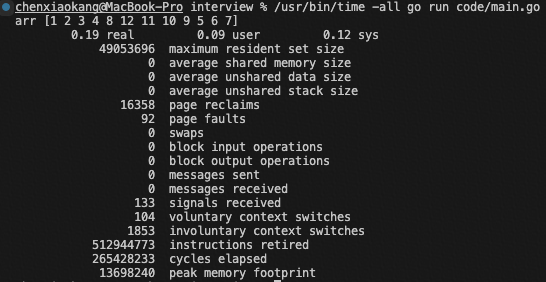

# Linux命令

[toc]

## 一、time

time命令常用于测量一个命令的运行时间，包括CPU、内存和I/O。
简单的time命令不能得到内存和I/O数据，只能获取CPU资源的统计包括：

- 实际使用时间（real time）
- 用户态使用时间（the process spent in user mode）
- 内核态使用时间（the process spent in kernel mode）

如果想获取更多信息，可以使用`/user/bin/time -all`命令：
