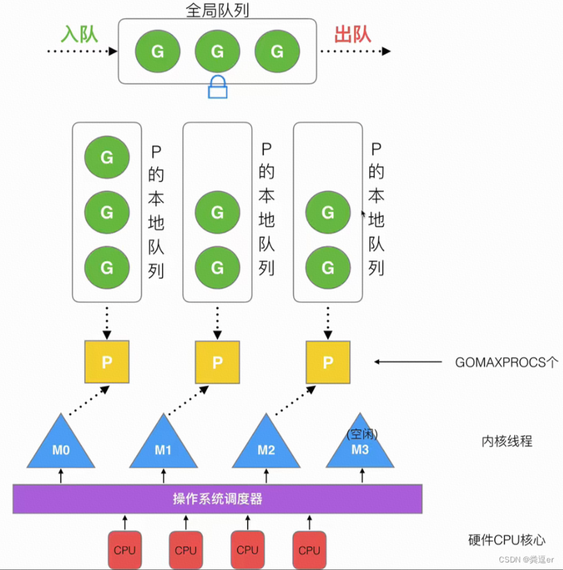

# Golang

[toc]

## 一、golang 中 make 和 new 的区别

1）作用变量类型不同，new给string,int和数组分配内存，make给切片，map，channel分配内存；
2）返回类型不一样，new返回指向变量的指针，make返回变量本身；
3）new 分配的空间被清零。make 分配空间后，会进行初始化；

1. 初始化的区别
make和new都是golang用来分配内存的内建函数，且都在堆上分配内存。不同的是，new分配空间后，将内存清零，并不会出初始化内存，而make分配空间后，会初始化内存，而不是清零；
2. 分配对象的区别
new(T)为每个类型（包括int、string这种基本类型）分配内存，而make专门为`slice`、`map`、`chan`三种类型分配内存；
3. 返回类型的区别
new返回的是变量的指针，而make返回的是变量本身（因为slice、map、chan本身就是引用类型）

## 二、数组和切片的区别

1）定义方式不一样；
2）初始化方式不一样，数组需要指定大小，大小不改变；
3）在函数传递中，数组切片都是值传递；

数组和切片的定义及初始化：

```golang
// 数组
var a1 [3]int // 声明式
var a2 [...]int{1,2,3} // 推导式
a3 := [5]int{1,2,3}
var a4 = new([4]int)

// 切片
// 因为是动态扩容，所以更常用一些
// 扩容策略：小于1024则翻倍，大于1024则增加25%容量
var a1 []int
var a2 := make([]int, 3, 5) // len=3; cap=5
```

## 三、rune类型是什么，怎么用

rune是int32类型的别名，在各方面都等价于它，用来区分字符串和整数值，使用单引号定义。用途如下：

1. 统计带中文字符串的长度

    ```go
    fmt.Println(len("Go编程语言"))         // 14
    fmt.Println(len([]rune("Go编程语言"))) // 6
    ```

2. 截取带中文的字符串

    ```go
    // 对于包含中文的字符串，如果用rune，可以很方便的根据
    // 需要截取的位置进行对包含中文字符串进行截断
    s := "Go编程语言"
    fmt.Println(s[:8])                 // Go编程
    fmt.Println(s[:7])                 // Go编�
    fmt.Println(string([]rune(s)[:4])) // Go编程
    ```

## 四、golang 中解析 tag 是怎么实现的？反射原理是什么？

Go 中解析的 tag 是通过反射实现的，反射将接口变量转换成反射对象 Type 和 Value。
反射可以通过反射对象 Value 还原成原先的接口变量；反射可以用来修改一个变量的值。
tag是啥:结构体支持标记。

## 五、golang 中的 gc

Go V1.3：标记清除法，整体过程需要STW（stop the world），效率极低；
Go V1.5：三色标记法，堆空间进行写屏障，栈空间不启动，全部扫描完后，需要重新扫描一次栈，效率普通；
Go V1.8：三色标记+混合写屏障，栈空间不启动，堆空间启动，整个空间几乎不需要STW，效率较高；

1. 三色标记法扫描过程中，如果不受STW保护，当满足下面两个条件，会出现对象丢失的情况

      - 条件1：一个白色对象被黑色对象引用
      - 条件2：一个白色对象被上游灰色对象断开

2. 为了去除STW，并且不出现对象丢失的情况，引入强弱三色不变式，只要满足之一即可

     - 强三色不变式（破坏条件1）：强制不允许黑色对象引用白色
     - 弱三色不变式（破坏条件2）：黑色对象可以引用白色对象，但是白色对象上游必须包含灰色对象

3. 屏障机制

    - 插入屏障：插入一个对象时，标记该对象为灰色；不足：结束时需要STW重新扫描栈
    - 删除屏障：删除一个对象时，标记该对象为灰色；不足：回收精度低，一个对象即使被删除了，最后一个指向它的指针也能活过这一轮，在下一轮GC中被清除掉

4. 混合写屏障（最优）
    1）GC开始时，将栈上全部对象扫描，并标记为黑色；（之后不需要重新扫描，无需STW）
    2）GC期间，任何栈上的创建对象，均标记为黑色；
    3）被删除的对象标记为灰色；
    4）被添加的对象标记为灰色；

GC触发机制：

1. 主动触发：runtime.GC()
2. 定期触发：默认每2分钟，golang的守护进程会触发
3. 内存分配量超过阈值

## 六、golang 中的内存管理

栈内存：「栈内存」是计算机对`连续内存`（虚拟内存）采取的「线性分配」管理方式，便于高效存储指令运行过程中的临时变量。
堆内存：

## 七、golang 中的GMP

- G：goroutine，用户态线程-协程；
- M：thread，内核态线程；
- P：processor，协程调度器；



Go指令调度流程：

1. 执行`go func()`，先创建一个G，优先放入P的本地队列（最多256个），如果满了，放入全局队列 ；
2. M获取G，优先从M的本地队列P中获取G，如果为空，则依次去`全局队列`、`其他M的本地队列`去偷取G；
3. M调用并执行G，会执行G中的func()函数（每个G的运行时间不超过10ms-时间片）；
4. go的协程调度器数量默认为cpu核心数量，可以通过`runtime.GOMAXPROCS(n)`去设置；

## 八、golang interface 实现原理

interface数据结构：

```golang
// 非空接口定义
type iface struct {
  tab  *itab // 非空接口的类型信息，里面包含了*_type，还有fun数组，存储抽象方法集
  data unsafe.Pointer //指向原始数据指针
}

// 空接口定义
type eface struct {
  _type *_type //类型信息
  data  unsafe.Pointer //数据信息，指向数据指针
}
```

`_type 是go里面所有类型的一个抽象`，里面包含GC，反射，大小等需要的细节，它也决定了data如何解释和操作。
里面包含了非常多信息类型的大小、哈希、对齐以及种类等自动。

## 九、golang channel 实现原理

channel的实现在src/runtime/chan.go中，内部是一个循环链表。包含buf, sendx, recvx, lock ,recvq, sendq几个部分；

- buf，存储缓冲数据；
- sendx、recvx记录循环链表中收和发的index；
- lock是个互斥锁，确保线程安全；
- recvq、sendq分别是接收（<-channel）或者发送（channel<-x）的goroutine抽象出来的结构体，是个双向链表；

## 十、golang 内存逃逸

- 栈内存：由编译器进行管理，自动申请、分配、释放。大小一般固定；
- 堆内存：人为手动进行管理，手动申请、分配、释放，硬件内存多大堆内存就有多大，分配速度慢，且会形成内存碎片；

在golang中，内存优先栈分配。逃逸分析用于在堆和栈分配进行选择，通过在编译时期做gc，编译器追踪变量在代码块的作用域，判断变量的引用关系，来决定在栈还是在堆进行分配。`如果作用域外部没有引用，则放到栈中，否则放到堆中`。

**逃逸场景：**

```go
// 1. 指针逃逸
func sum(a, b int) *int {
  res := a + b
  // 局部变量res逃逸到堆上
  return &res
}

// 2. 栈空间不足
// 1W的切片会逃逸
func Slice() {
  s := make([]int, 10000, 10000)
  
  for index, _ := range s {
    s[index] = index
  }
}

// 3. 动态类型逃逸
// fmt.Println(a ...interface{})，编译阶段无法确定其类型
func main() {
  s := "Escape"
  fmt.Println(s)
}

// 4. 闭包引用对象逃逸
// 返回一个匿名函数被称为”闭包“
func Fibonacci() func() int {
  a, b := 0, 1
  return func() int {
    a, b = b, a+b
    return a
  }
}
```

**如何避免内存逃逸：**

1. 尽量减少外部指针引用，必要时使用值传递；
2. 尽量不写闭包函数，可读性差且发生逃逸；
