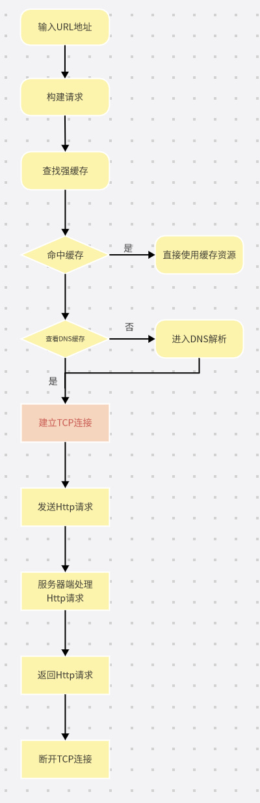
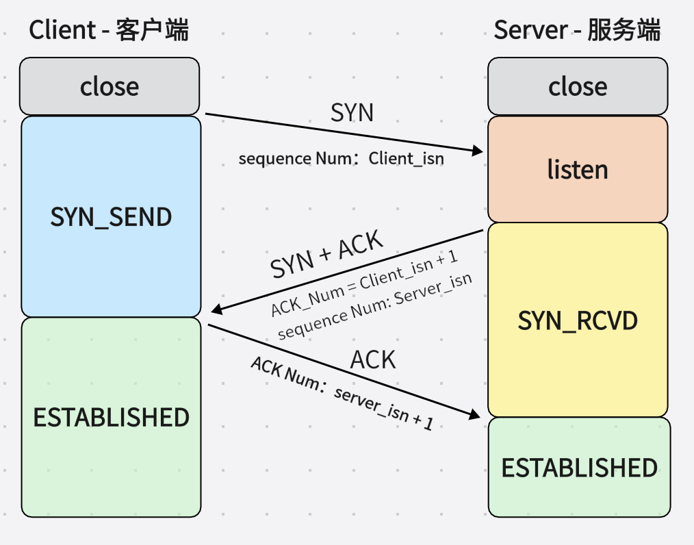

# 计算机网络

[toc]

## 浏览器输入url到返回资源

当我们在浏览器地址输入栏输入了一段地址之后会有如下操作依次发生：

## tcp协议

参考：[TCP连接的过程](https://blog.csdn.net/weixin_51338848/article/details/127691543)

1. tcp三次握手

    - 一开始客户端和服务端都处于`close`状态
    - 服务端主动监听一个端口，进入`listen`状态
    - 客户端发送SYN包（表示希望建立TCP连接），其中SYN的值是随机生成的序列号，将请求报文
    发送给服务端后，自己进入`sync_send`状态
    - 服务端接收到客户端发送的SYN包，会返回一个ACK包（确认，其值为client_num + 1）和一个SYN包。
    同时ACK和SYN的标记位置为1，将报文发送到客户端，自己进入`sync_rcvd`状态
    - 此时客户端收到来自服务端的确认包，可以保证客户端已经接收到了他的请求，此时需要发送一个ACK确认包，值为server_num + 1，并将ACK标记位置为1，发送报文后自己进入`established`状态
    - 服务端接收到来自客户端发送的报文后，进入`established`状态，此时双方建立连接

2. tcp四次挥手

    - 一开始的时候服务端和客户端处于`established`状态
    - 客户端首先先想要断开连接，这时会向服务端发送一个FIN包，包中有一个序列号，表示想断开
    连接，并进入`fin`状态
    - 此时服务端收到了客户端送来的FIN包之后，会先给客户端发送一个ACK包，`报文序列号为客户端序列号+1`，表示自己已经收到了，但是需要检查一下自己还有没有什么要发送的资源，并且进入`close_wait`状态
    - 等到服务端检查完后，会向客户端发送FIN包，表示即将断开连接，并且进入到`last_ack`状态
    - 客户端收到了FIN包之后，再次发送一次ACK包，`报文序列号为服务端序列号+1`，表示自己已经收到了，随后进入`time_wait`状态，等待`2msl`之后，就进入`close`状态
    - 服务端接收到来自客户端发送的ACK包之后，也进入`close`状态

3. 为什么不采用两次握手，一定要三次

    第一次握手：客户端向服务端发送网络包，服务端接收到了，可以证明：
    `服务端知道客户端的发送能力`
    第二次握手：服务端回包，客户端接收到了，可以证明：
    `客户端知道服务端的接收能力和发送能力`
    之所以需要三次握手，是因为二次握手后，`服务端不知道客户端的接收能力`

4. 三次握手的过程中可以发送数据么
可以的，第三次握手时，客户端已经知道了双方收发包都是没有问题的，所以已经可以发送数据了。

5. 为什么要有 TIME_WAIT
确保服务端收到最后由客户端发起的ACK包，如果服务端没有收到ACK包的话，服务端会再向客户端
发送一个FIN包，因为time_wait时间至少是一个报文的来回时间，一般会使用及时，时间到了，说明
服务端已经成功收到ACK，客户端进入close状态

6. 序列号和确认号
序列号：
随机出来的一个ID，为本次TCP连接建立一个标志，用来解决`网络包乱序`问题
确认号：
用来表示[接受端]告诉[发送端]对上一个数据包已经成功接收，用来解决`网络包丢失`问题
