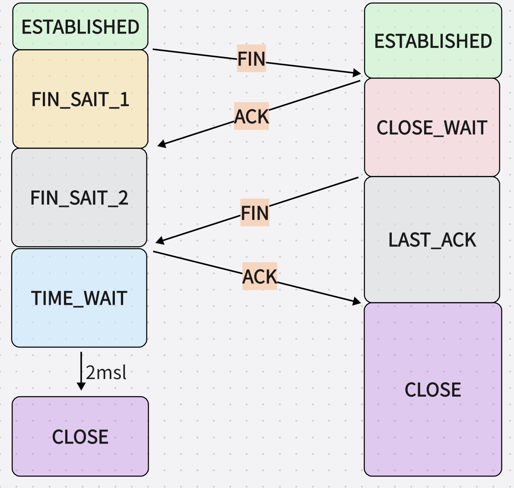

# 计算机网络

[toc]

## 一、浏览器输入url到返回资源

当我们在浏览器地址输入栏输入了一段地址之后会有如下操作依次发生：

## 二、tcp协议

参考：[TCP连接的过程](https://blog.csdn.net/weixin_51338848/article/details/127691543)

1. tcp三次握手

    - 一开始客户端和服务端都处于`close`状态
    - 服务端主动监听一个端口，进入`listen`状态
    - 客户端发送SYN包（表示希望建立TCP连接），其中SYN的值是随机生成的序列号，将请求报文
    发送给服务端后，自己进入`sync_send`状态
    - 服务端接收到客户端发送的SYN包，会返回一个ACK包（确认，其值为client_num + 1）和一个SYN包。
    同时ACK和SYN的标记位置为1，将报文发送到客户端，自己进入`sync_rcvd`状态
    - 此时客户端收到来自服务端的确认包，可以保证客户端已经接收到了他的请求，此时需要发送一个ACK确认包，值为server_num + 1，并将ACK标记位置为1，发送报文后自己进入`established`状态
    - 服务端接收到来自客户端发送的报文后，进入`established`状态，此时双方建立连接

2. tcp四次挥手

    - 一开始的时候服务端和客户端处于`established`状态
    - 客户端首先先想要断开连接，这时会向服务端发送一个FIN包，包中有一个序列号，表示想断开
    连接，并进入`fin`状态
    - 此时服务端收到了客户端送来的FIN包之后，会先给客户端发送一个ACK包，`报文序列号为客户端序列号+1`，表示自己已经收到了，但是需要检查一下自己还有没有什么要发送的资源，并且进入`close_wait`状态
    - 等到服务端检查完后，会向客户端发送FIN包，表示即将断开连接，并且进入到`last_ack`状态
    - 客户端收到了FIN包之后，再次发送一次ACK包，`报文序列号为服务端序列号+1`，表示自己已经收到了，随后进入`time_wait`状态，等待`2msl`之后，就进入`close`状态
    - 服务端接收到来自客户端发送的ACK包之后，也进入`close`状态

3. 为什么不采用两次握手，一定要三次

    第一次握手：客户端向服务端发送网络包，服务端接收到了，可以证明：
    `服务端知道客户端的发送能力`
    第二次握手：服务端回包，客户端接收到了，可以证明：
    `客户端知道服务端的接收能力和发送能力`
    之所以需要三次握手，是因为二次握手后，`服务端不知道客户端的接收能力`

4. 三次握手的过程中可以发送数据么
可以的，第三次握手时，客户端已经知道了双方收发包都是没有问题的，所以已经可以发送数据了。

5. 为什么要有 TIME_WAIT
确保服务端收到最后由客户端发起的ACK包，如果服务端没有收到ACK包的话，服务端会再向客户端
发送一个FIN包，因为time_wait时间至少是一个报文的来回时间，一般会使用及时，时间到了，说明
服务端已经成功收到ACK，客户端进入close状态

6. 序列号和确认号
序列号：
随机出来的一个ID，为本次TCP连接建立一个标志，用来解决`网络包乱序`问题
确认号：
用来表示[接受端]告诉[发送端]对上一个数据包已经成功接收，用来解决`网络包丢失`问题

7. 为什么等待 2 MSL
两个原因：

- 防止具有相同【四元组】的旧数据包被收到
  2msl足够让两个方向的数据包都丢弃，不会出现因网络延迟导致在新的连接中，客户端收到旧连接产生的包
- 确保服务端连接正确关闭
  如客户端四次挥手中果最后一次ack丢失，客户端直接close掉的话，服务端就会一直last_ack（无法重试，因为客户端已关闭）。如果time_wait时间为2msl，服务端在没有收到最后一次ack时，就会重发Fin来关闭连接，从客户端发起最后一个ack到服务端重试报文最终再次到达客户端的最长时间为2msl

## 三、网络基础知识

### 3.1 基础概念

1. 交换机
交换机会维护一张MAC地址表，用于交换机下不同设备端口到端口的通信（局域网内部两台设备首次通信通过广播形式）
2. NAT
网络地址转换（net address transfer）帮助局域网设备通过私有ip地址访问互联网
   - 私有ip地址（也称内网地址），通常为10.0.0.0/8、172.16.0.0/12、192.168.0.0/16，在互联网上不唯一
   - 公共ip地址（也称公网地址），可以在互联网上进行识别和寻址，在互联网上唯一
   - NAT转换，当局域网设备通过路由器WAN口访问互联网时，将内网地址转换为外网地址
   - 路由表，路由器中维护一张路由表，记录着局域网设备的ip以及对应的公网ip+端口
   - 端口转发，通过在路由器上配置端口映射规则，路由器可以将外部网络的请求转发到局域网设备的私有ip+端口上
3. DHCP
动态分配ip。不需要内网设备进行账号密码登录，自动分配ip地址的协议
4. frp
内网穿透，外网可以访问内网部署的服务。frp主要由frp客户端和frp服务端组成。服务端部署在公网服务器上，客户端部署在需要穿透的客户端主机上。
通俗理解：frp服务器就像接线员，frp客户端就像座机，当我们使用外部公共电话拨打时，先到接线员这里，要求转到某个座机，接线员就从座机列表中找到对应的座机，转接过去，这样就完成了外部访问内网服务的过程。
使用场景：ssh访问内网机器

### 3.2 网络工作模式

1. Bridge桥接模式
桥接模式下宿主机和虚拟机在同一网段，可以认为通过`虚拟网桥`来让虚拟机像物理设备一样和宿主机在同一路由器下
2. NAT模式
桥接模式可能会导致一定的ip资源紧张，通过NAT（引入`虚拟NAT设备`、`虚拟DHCP服务器`、`虚拟网卡`）
3. Host-Only模式
无法访问到外网，仅能通过虚拟网卡和主机进行相互通信。但是可以通过主机物理网卡通过共享的方式和虚拟网卡连接，使得虚拟机可以访问到主机物理网卡，从而访问外网（相比于NAT模式，删除了`虚拟NAT设备`）

桥接不需要虚拟网卡（通过虚拟网桥连接主机物理网卡和虚拟交换机）、NAT和Host-Only需要虚拟网卡
