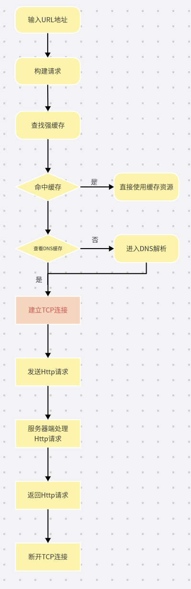
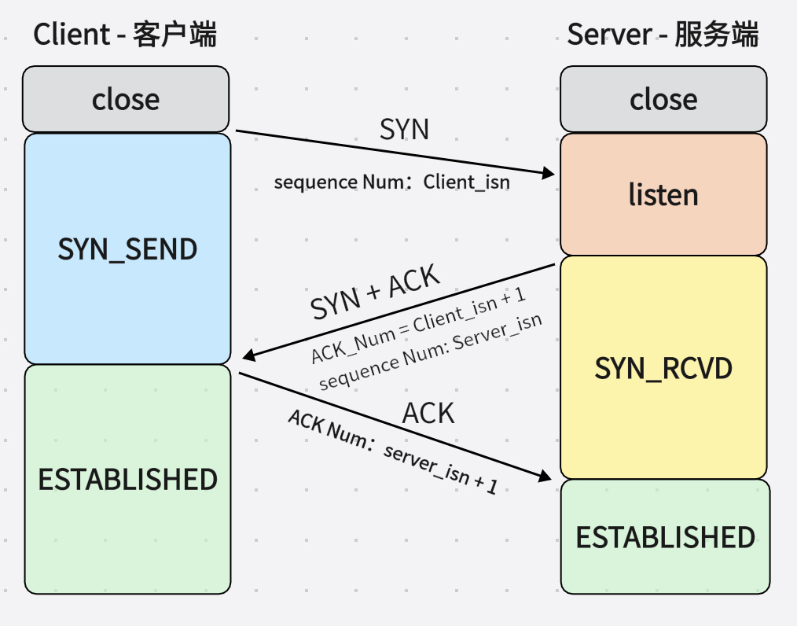
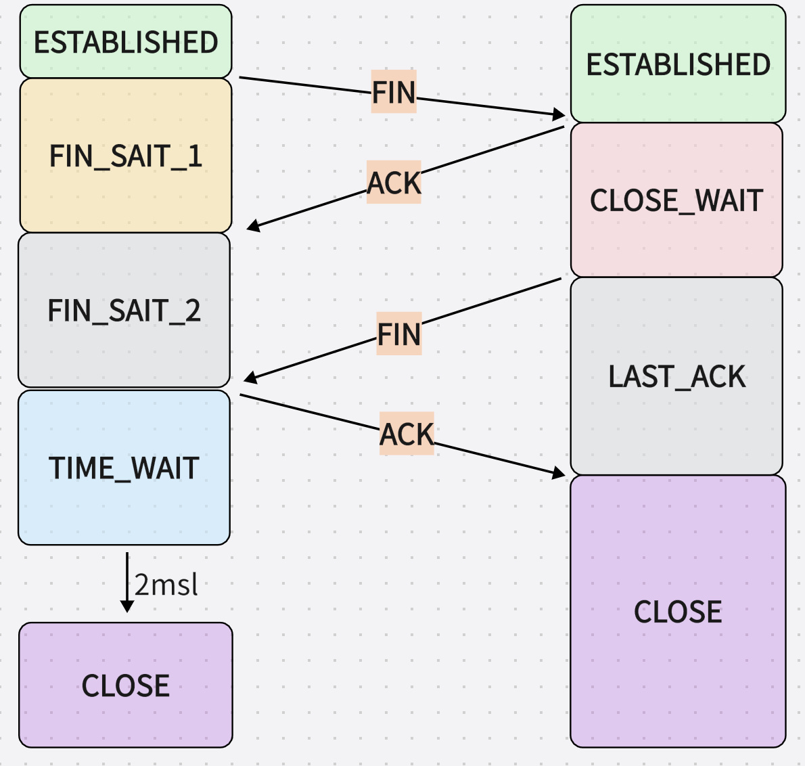

# 计算机网络面试题

参考：https://zhuanlan.zhihu.com/p/466239718

[toc]

## 浏览器输入url到返回资源

当我们在浏览器地址输入栏输入了一段地址之后会有如下操作依次发生：

## tcp协议

参考：[TCP连接的过程](https://blog.csdn.net/weixin_51338848/article/details/127691543)

1. tcp三次握手

    - 一开始客户端和服务端都处于`close`状态
    - 服务端主动监听一个端口，进入`listen`状态
    - 客户端发送SYN包（表示希望简历TCP连接），其中SYN的值是随机生成的序列号，将请求报文
    发送给服务端后，自己进入`sync_send`状态
    - 服务端接收到客户端发送的SYN包，会返回一个ACK包（确认，其值为client_num + 1）和一个SYN包。
    同时ACK和SYN的标记位置为1，将报文发送到客户端，自己进入`sync_rcvd`状态
    - 此时客户端收到来自服务端的确认包，可以保证客户端已经接收到了他的请求，此时需要发送一个ACK确认包，值为server_num + 1，并将ACK标记位置为1，发送报文后自己进入`established`状态
    - 服务端接收到来自客户端发送的报文后，进入`established`状态，此时双方建立连接

2. tcp四次挥手

3. 为什么不采用两次握手，一定要三次

4. 为什么要有 TIME_WAIT

